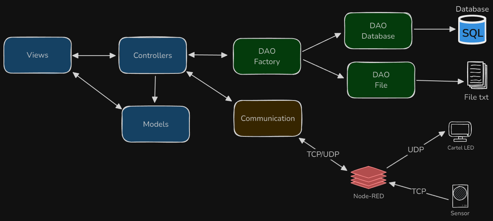

# Monitor IoT

Monitor IoT es un proyecto de servidor IoT que escucha datos a través de TCP y UDP, los procesa y luego los envía a Node-RED para su visualización en un cartel LED. El proyecto también incluye una aplicación cliente `IotClient` que permite enviar datos por UDP al servidor `IotServer`.

## Tabla de Contenidos

- [Arquitectura](#arquitectura)
- [Instalación](#instalación)
- [Configuración](#configuración)
- [Contribuciones](#contribuciones)
- [Licencia](#licencia)

## Arquitectura



El proyecto IotServer está diseñado con una arquitectura basada en el patrón MVC (Model-View-Controller) y utiliza el patrón arquitectónico DAO (Data Access Object) para la gestión de la persistencia de datos. Se añadió una capa de comunicación para manejar conexiones tanto TCP como UDP.

`IotServer` es una aplicación de consola desarrollada en C# .NET, que escucha mensajes de sensores a través de TCP. También escucha mensajes por UDP que los procesa, y luego reenvía los datos a Node-RED mediante otro puerto UDP para su visualización en tiempo real.

`IotClient` es una aplicación de consola en C# .NET que permite enviar un mensaje de texto por UDP a IotServer.

## Instalación

### Prerrequisitos

- SDK .NET 8.0
- NodeJS y npm
- Node-RED
- SQL Server

### Pasos

1. **Clona el repositorio**:
    ```bash
    git clone https://github.com/tu-usuario/IotMonitor.git
    cd IotMonitor
    ```

2. **Restaura las dependencias**:
    ```bash
    dotnet restore
    ```

3. **Compila el proyecto**:
    ```bash
    dotnet build
    ```

4. **Instala Node-RED**:
    ```bash
    npm install -g node-red
    ```

## Configuración

El proyecto utiliza un archivo `appsettings.json` para configurar puertos e IPs. Este archivo debe estar en la raíz del proyecto `IotServer`. Asegúrate de que las configuraciones de IP y puerto en `appsettings.json` coincidan con las configuraciones de Node-RED y otros dispositivos.

También debes asegurarte que la conexión a tu base de datos sea correcta. Por otro lado, la configuración de `Persistencia` puede tomar el valor de *file* o *database* para determinar el destino del almacenamiento del log.

```json
{
  "UdpSettings": {
    "UdpServerPort": 12345,
    "NodeRedServerIp": "127.0.0.1",
    "NodeRedServerPort": 6789,
    "Persistencia": "file",
    "FilePath": "Logs/LogSensores.txt",
    "ConnectionString": "Server=yourserver;Database=yourdb;User Id=youruser;Password=yourpassword;"
  },
  "TcpSettings": {
    "TcpServerPort": 54321,
    "Persistencia": "database",
    "FilePath": "",
    "ConnectionString": "Server=yourserver;Database=yourdb;User Id=youruser;Password=yourpassword;"
  }
}
```

Utiliza el script ubicado en `Scripts/SQL/Database.sql` para crear la estructura de la base de datos.

En `Scripts/NodeRED/flows.json` tienes los flujos para los simuladores de sensor TCP y el cartel UDP. Esto lo puedes importar dentro de la aplicación Node-RED.

Para correr la aplicación de Node-RED, debes ejecutar el siguiente comando:
```
node-red
```


## Contribuciones

Las contribuciones son bienvenidas. Por favor, sigue el flujo estándar de GitHub para realizar un fork, crear una rama, hacer cambios, y enviar un pull request.

## Licencia

Este proyecto está licenciado bajo la Licencia MIT. Esto significa que eres libre de usar, copiar, modificar, fusionar, publicar, distribuir, sublicenciar y/o vender copias de este software, siempre y cuando incluyas la declaración de derechos de autor original y la licencia en todas las copias o partes sustanciales del software.

Puedes ver la licencia completa en el archivo [LICENSE](LICENSE) que acompaña este proyecto.