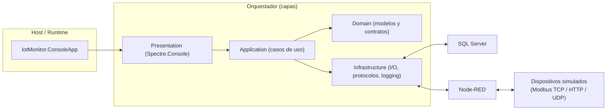

# Console Monitor Devices

Orquestador *stateful* para monitoreo y control de dispositivos industriales y de seguridad. La consola se apoya en **Spectre.Console** y se integra con un ecosistema simulado en **Node-RED**.

## Tabla de Contenidos

- [Arquitectura](#arquitectura)
- [Instalación](#instalación)
- [Configuración](#configuración)
- [Contribuciones](#contribuciones)
- [Licencia](#licencia)

## Arquitectura

La comunicacion se organiza por ciclo de vida del dispositivo:

| Tipo de Conexion | Protocolo | Comportamiento | Tipo de dispositivo |
| --- | --- | --- | --- |
| Always-On | Modbus TCP | Socket abierto permanentemente con polling activo. | Sensores |
| On-Demand | TCP / HTTP | Abre conexion, envia comando/peticion y cierra. | Barreras, Semaforos, Camara |
| Fire & Forget | UDP | Envia datagramas sin confirmacion. | Carteles |

- Patron de herencia de datos (TPT) para separar la definicion base de dispositivos de su configuracion por protocolo.
- Polimorfismo operativo con una clase base abstracta (`DeviceBase`) y clases hijas por protocolo.
- Segregacion de interfaces para acciones especificas (`IPhotographic`, `ILightController`, etc.).

Diagrama de alto nivel de comunicacion entre capas y componentes:

```mermaid
flowchart LR
	subgraph Host["Host / Runtime"]
		ConsoleApp["IotMonitor.ConsoleApp"]
	end

	subgraph Orchestrator["Orquestador (capas)"]
		Presentation["Presentation (Spectre.Console)"]
		Application["Application (casos de uso)"]
		Domain["Domain (modelos y contratos)"]
		Infrastructure["Infrastructure (I/O, protocolos, logging)"]
	end

	ConsoleApp --> Presentation --> Application --> Domain
	Application --> Infrastructure
	Infrastructure <--> SQL["SQL Server"]
	Infrastructure <--> NodeRED["Node-RED"]
	NodeRED <--> Devices["Dispositivos simulados\n(Modbus TCP / HTTP / UDP)"]
```

## Instalacion

1. Instalar Docker y Docker Compose.
2. (Opcional) Definir `MSSQL_SA_PASSWORD` si no quieres usar el valor por defecto del compose.
3. Ejecutar `docker compose up --build`.

## Configuracion

- `MSSQL_SA_PASSWORD`: password de SQL Server (defecto en compose: `DevContainer_Sql_123!`).
- `IOTMONITOR__LOGGING__DESTINATION`: destino de logs en el contenedor (defecto: `Console`).
- Puertos expuestos: SQL Server `1433` y Node-RED `1880`.

## Contribuciones

Pendiente de definir.

## Licencia

MIT. Ver [LICENSE](LICENSE).
