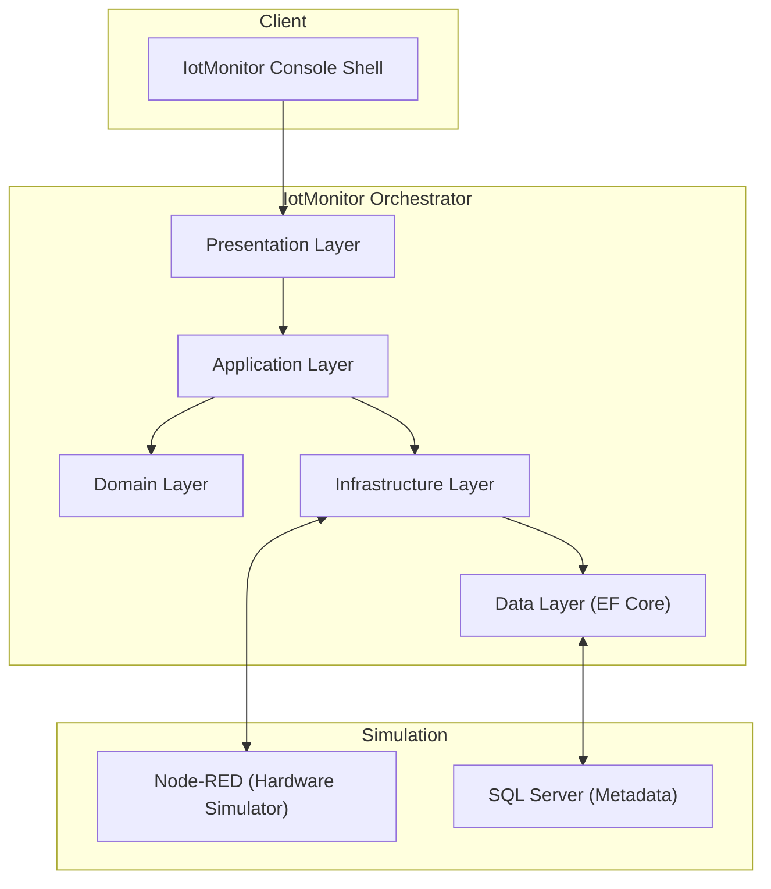

# IotMonitor - Console Monitor Devices

**IotMonitor** is a stateful infrastructure orchestrator designed to centralize the monitoring and control of industrial and security devices. It provides a tactical terminal interface for real-time health monitoring and direct command execution over various protocols.

## 🚀 Features

*   **Hierarchical Navigation:** Navigate through Categories -> Devices -> Actions for intuitive control.
*   **Live Dashboard:** Real-time health monitoring of all devices with automatic status updates.
*   **Dynamic Action Menus:** Actions are automatically discovered and displayed based on the device's implemented capabilities (e.g., Taking photos, Modbus coil switching).
*   **Multi-Protocol Support:**
    *   **Always-On (Modbus TCP):** Persistent monitoring for industrial sensors.
    *   **On-Demand (HTTP/TCP):** Sequential command execution for IP Cameras, Barriers, and Traffic Lights.
    *   **Fire & Forget (UDP):** Unidirectional messaging for LED signs.
*   **Stateful Orchestration:** Maintains a runtime snapshot of all device states.
*   **Clean UI:** Powered by **Spectre.Console**, providing a polished CLI experience without log clutter.

## 🏗️ Architecture

### Component Architecture
The system follows a modular architecture integrating with a simulated hardware environment:


```mermaid
flowchart TD
    subgraph Client
        CLI["IotMonitor Console Shell"]
    end

    subgraph Core["IotMonitor Orchestrator"]
        Presentation["Presentation Layer"]
        Application["Application Layer"]
        Domain["Domain Layer"]
        Infrastructure["Infrastructure Layer"]
        Data["Data Layer (EF Core)"]
    end

    subgraph Simulation
        NodeRED["Node-RED (Hardware Simulator)"]
        SQL["SQL Server (Metadata)"]
    end

    CLI --> Presentation
    Presentation --> Application
    Application --> Domain
    Application --> Infrastructure
    Infrastructure --> Data
    Data <--> SQL
    Infrastructure <--> NodeRED
```

### Internal Architecture
*   **Domain-Driven Design:** Core logic and contracts reside in the Domain layer, independent of external frameworks.
*   **Table-Per-Type (TPT) Inheritance:** The database uses TPT to store shared device data and protocol-specific configurations separately.
*   **Interface Segregation:** Specific capabilities like `IPhotographic` or `IAccessController` are isolated, ensuring devices only implement what they support.
*   **Stateful Services:** The `DeviceOrchestrator` maintains an in-memory dictionary of `DeviceSnapshot` objects, reflecting the live status of the entire infrastructure.

## 🛠️ Prerequisites

*   **Docker Desktop** (or Docker Engine on Linux)
*   **.NET 8 SDK** (if running/developing locally)

## 🚦 Getting Started

### 1. Run the Simulation Environment
The easiest way to see IotMonitor in action is using Docker Compose, which spins up the SQL Server and the Node-RED hardware simulator:

```bash
docker compose up -d --build
```

### 2. Manual Configuration (Required)
Once the containers are running, you must seed the data to simulate the devices:

*   **Database Seeding:** Execute the SQL script located in `seed/sql/seed_devices.sql` against the running SQL Server instance (port 1433). This populates the categories, device types, and initial devices.
*   **Node-RED Flows:** 
    1. Access the Node-RED editor at `http://localhost:1880`.
    2. Import the flow definition file from `seed/node-red/flows.json` (Menu -> Import).
    3. Click **Deploy**. This enables the simulated Modbus, HTTP, and UDP endpoints.

### 3. Run the Console Application
You can run the application directly from your terminal:

```bash
dotnet run --project src/IotMonitor.ConsoleApp/IotMonitor.ConsoleApp.csproj
```

### 3. Usage
1.  Launch the app to see the **Live Dashboard**.
2.  Select **"Gestionar Categorias"** to browse devices.
3.  Choose a device to see its **Dynamic Actions** (e.g., "Tomar Foto" for cameras).

## 🧪 Testing

Execute the test suite to ensure system integrity:

```bash
dotnet test
```

## 🤝 Contributing

1.  Fork the repository.
2.  Create a feature branch (`git checkout -b feature/AmazingFeature`).
3.  Commit your changes (`git commit -m 'Add some AmazingFeature'`).
4.  Push to the branch (`git push origin feature/AmazingFeature`).
5.  Open a Pull Request.

## 📄 License

Distributed under the **MIT License**. See `LICENSE` for more information.

---
**Project maintained by:** [maadcode](https://github.com/maadcode)
