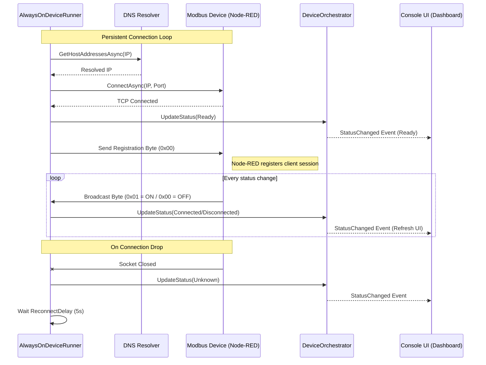
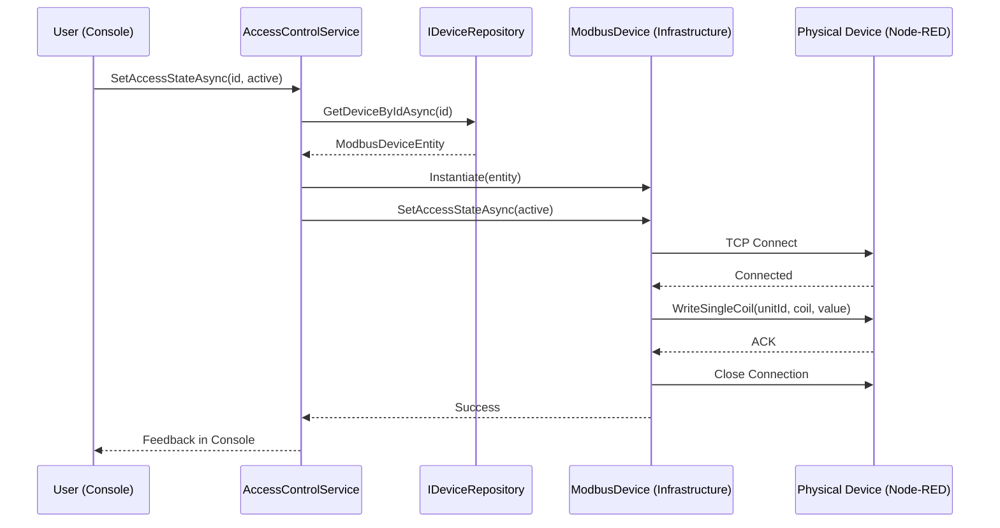

# Always-On (Modbus TCP) Sequence Diagrams

The Always-On pattern is used for devices that maintain a persistent TCP connection, such as industrial sensors and controllers.

## Status Monitoring (Sensor)

This flow shows how the system maintains a persistent connection and receives real-time updates from a sensor.

## Command Execution (Barrier/Traffic Light)

Commands are executed on-demand, opening a temporary connection for the protocol transaction.

