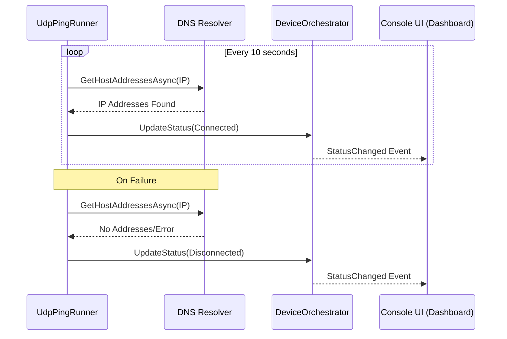
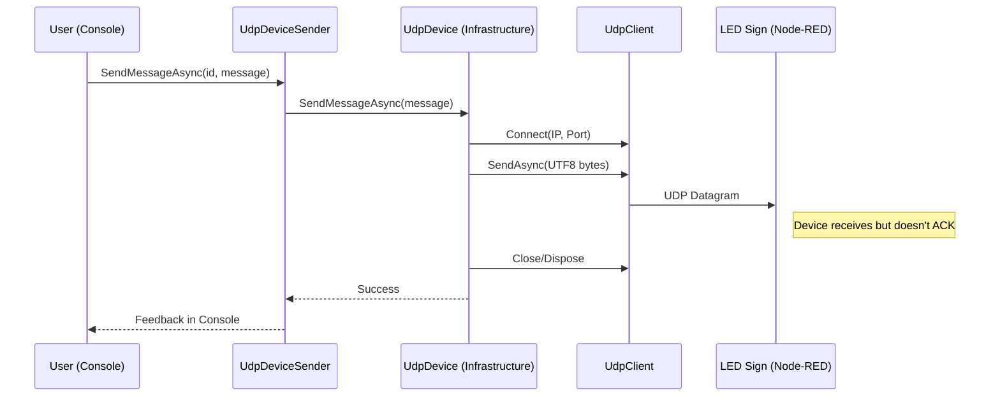

# Fire & Forget (UDP) Sequence Diagrams

The Fire & Forget pattern is used for devices where low latency is preferred over delivery guarantees, such as LED Message Signs.

## Status Monitoring (DNS Ping)

Since UDP is connectionless, reachability is estimated via DNS resolution.

## Command Execution (Send Message)

Datagrams are sent without awaiting a response from the device.

