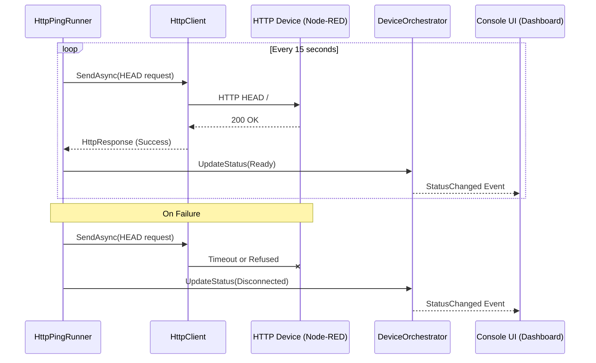
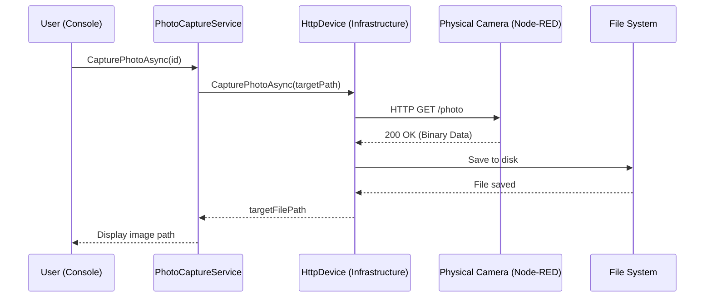

# On-Demand (HTTP) Sequence Diagrams

The On-Demand pattern is used for devices that follow a request-response cycle over HTTP, such as IP Cameras.

## Status Monitoring (Ping)

A background runner periodically checks if the device is reachable.

## Command Execution (Capture Photo)

The action is executed by opening a connection, retrieving data, and closing it.

